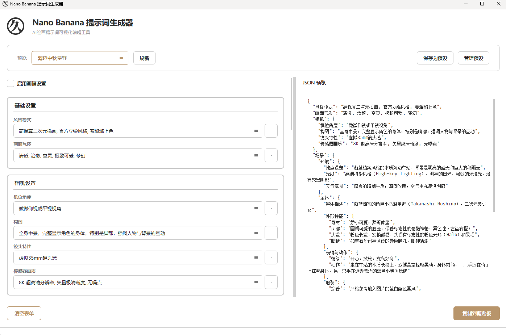

<p align="center">
  
</p>

<h1 align="center">Nano Banana 提示词生成器</h1>

<p align="center">
  <strong>一站式AI图片生成工具，通过结构化提示词控制图片生成质量。</strong>
</p>

<p align="center">
  
  
  
  
</p>

---

## 功能特性

- **可视化编辑** - 表单化编辑提示词，方便针对特定元素进行修改。
- **AI 智能生成** - 一句话描述生成完整结构化提示词
- **AI 修改** - 一句话描述对已有提示词进行修改
- **预设管理** - 保存/加载/删除常用提示词配置
- **一键复制** - 快速复制 JSON 到剪贴板
- **图片生成** - 通过gemini接口将提示词输入，直接生成图片

## 界面预览

* 主界面

----

* AI生成提示词界面

----

* AI修改提示词界面

----


## 快速开始

### 下载客户端使用

在[Releases](https://github.com/lissettecarlr/nano-banana-prompt-tool/releases)页面下载最新客户端，目前只编译了`windows`版本，解压后双击运行。


### 通过代码运行

#### 环境要求

- Python 3.10+

#### 安装

```bash
# 克隆仓库
git clone https://github.com/your-username/nano_banana_prompt_tool.git
cd nano_banana_prompt_tool

# 安装依赖
pip install -r requirements.txt
```

#### 运行

```bash
cd src
python main.py
```

#### 打包
```bash
python .\build.py 
``` 

## 使用说明

### 基础使用

1. 启动应用后，在左侧表单区域填写各项提示词参数
2. 右侧 JSON 预览区会实时显示生成的提示词
3. 点击「复制到剪贴板」将 JSON 复制到剪贴板

### AI 智能生成

本工具集成了 AI 智能生成功能，只需用自然语言描述你想要的画面，AI 即可自动生成完整的结构化提示词。

1. 点击主界面的「AI 生成」按钮
2. 首次使用需要点击「配置」设置 API 信息
3. 在输入框中描述你想要的画面，例如：
   - *"一个穿着白色连衣裙的少女站在樱花树下，春天的午后"*
   - *"赛博朋克风格的城市夜景，霓虹灯闪烁，雨后的街道"*
4. 点击「生成」，AI 会实时流式输出结果
5. 点击「应用到表单」将生成的内容填充到编辑器


### 预设管理

- **保存预设**: 点击「保存为预设」，输入名称保存当前配置
- **加载预设**: 从顶部下拉框选择已保存的预设
- **删除预设**: 点击「管理预设」→「删除预设」选择要删除的项目

### 配置下拉选项

编辑 `src/config/options.yaml` 文件可自定义各字段的下拉选项：

```yaml
风格模式:
  - "高保真二次元插画, 官方立绘风格, 赛璐璐上色"
  - "写实风格, 电影质感"

画面气质:
  - "清透, 治愈, 空灵"
  - "暗黑, 神秘, 深邃"
```

## 输出格式

生成的 JSON 提示词结构如下：

```json
{
  "风格模式": "...",
  "画面气质": "...",
  "场景": {
    "环境": { "地点设定": "...", "光线": "...", "天气氛围": "..." },
    "主体": {
      "整体描述": "...",
      "外形特征": { "身材": "...", "面部": "...", "头发": "...", "眼睛": "..." },
      "表情与动作": { "情绪": "...", "动作": "..." },
      "服装": { "穿着": "...", "细节": "..." },
      "配饰": "..."
    },
    "背景": { "描述": "...", "景深": "..." }
  },
  "相机": {
    "机位角度": "...",
    "构图": "...",
    "镜头特性": "...",
    "传感器画质": "..."
  },
  "审美控制": {
    "呈现意图": "...",
    "材质真实度": ["..."],
    "色彩风格": { "整体色调": "...", "对比度": "...", "特殊效果": "..." }
  }
}
```

## 效果

**使用提示词的时候附带了角色图，更多生成图见[pixiv](https://www.pixiv.net/users/18200513)**

----

* 海边中秋星野


----

* 庭院睡觉中秋星野


----

* 雪景下的中秋星野


----


